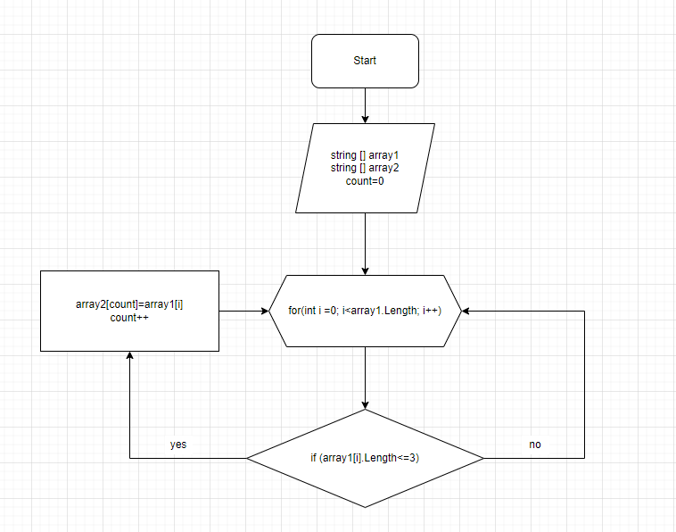

# Итоговоя домашняя работа

## Задача: 
### Написать программу, которая из имеющегося массива строк формирует новый массив из строк, длина которых меньше, либо равна 3 символам. Первоначальный массив можно ввести с клавиатуры, либо задать на старте выполнения алгоритма. При решении не рекомендуется пользоваться коллекциями, лучше обойтись исключительно массивами.

**Пример:**  [“Hello”, “2”, “world”, “:-)”] → [“2”, “:-)”]

## Описание решения:
### Сначала объявляется два массива, изначальный (*array1*) и второй (*array2*) такой же длины. Потом метод, в котором цикл равный длинне массива, внутри цикла проверка условия ( <=3 ), если да, элемент первого массива заносится в *count* элемент второго массива. Переменная *count* чтобы поочередно записывать из первого массива во второй. После присвоения увеличивается переменная *count* на 1 и возвращается к циклу *for* в котором *i* увеличивается на 1, и так проверяется до конца. В конце выводим на экран результат.

# Дополнительная информация
Добавили блок-схему задачи.
